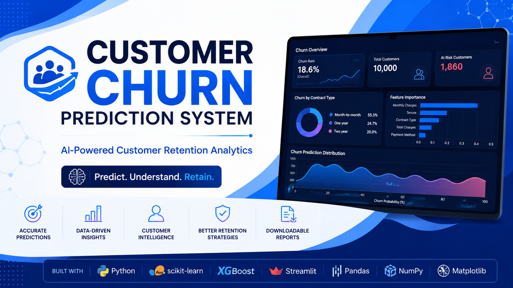
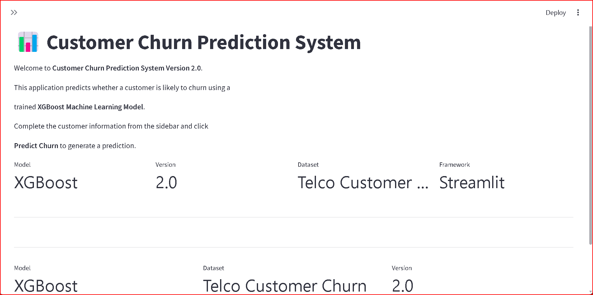
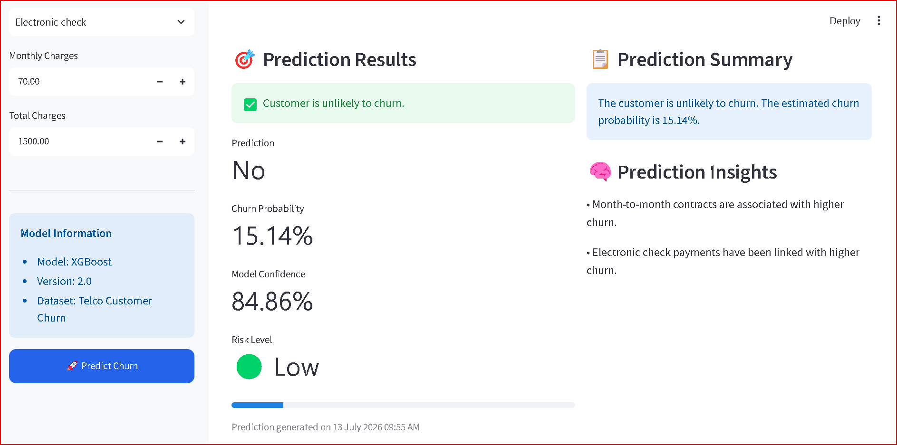
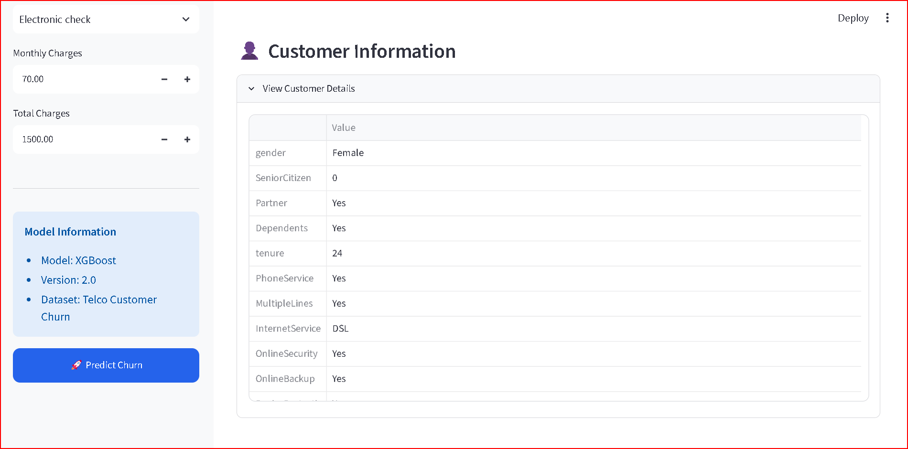
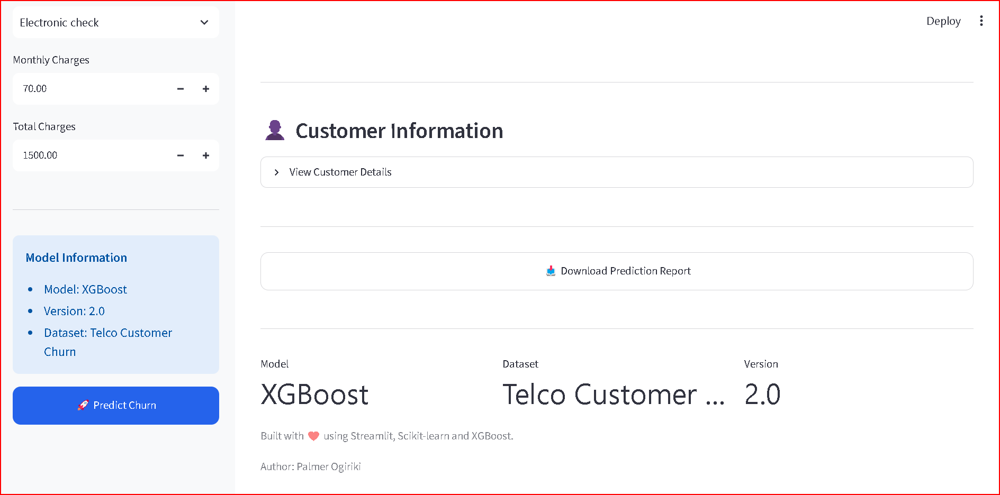

# 📊 Customer Churn Prediction System

<p align="center">
  
</p>

<p align="center">


</p>

---

# 📖 Overview

The **Customer Churn Prediction System** is an end-to-end machine learning application that predicts whether a customer is likely to leave a subscription-based business.

The project combines **data preprocessing**, **machine learning**, and an interactive **Streamlit** web application to provide instant churn predictions and downloadable prediction reports.

The model was trained using the **Telco Customer Churn Dataset** and uses an **XGBoost Classifier** to generate accurate predictions based on customer demographics, service usage, billing information, and account history.

---

# ✨ Features

* Predict customer churn in real time
* Interactive Streamlit dashboard
* User-friendly sidebar for customer information
* Churn probability score
* Risk level classification
* Confidence score visualization
* Customer summary table
* Downloadable prediction report (CSV)
* Clean and responsive interface
* Modular Python architecture

---

# 🛠 Technology Stack

| Category            | Technology            |
| ------------------- | --------------------- |
| Language            | Python                |
| Machine Learning    | XGBoost, Scikit-learn |
| Data Processing     | Pandas, NumPy         |
| Web Framework       | Streamlit             |
| Model Serialization | Joblib                |
| Version Control     | Git & GitHub          |

---

# 📂 Project Structure

```text
customer-churn-prediction-system/

├── app/
│   ├── app.py
│   ├── ui.py
│   ├── prediction.py
│   ├── model_loader.py
│   ├── styles.py
│   ├── utils.py
│   └── config.py
│
├── data/
├── docs/
├── figures/
├── models/
├── notebooks/
├── reports/
├── src/
├── tests/
│
├── requirements.txt
├── README.md
├── LICENSE
└── .gitignore
```

---

# 🧠 Machine Learning Pipeline

```
Customer Information
        │
        ▼
Data Preprocessing
        │
        ▼
Feature Engineering
        │
        ▼
XGBoost Classifier
        │
        ▼
Prediction
        │
        ▼
Probability Score
        │
        ▼
Risk Classification
        │
        ▼
Prediction Report
```

---

# 📷 Application Preview

## Home Page



---

## Prediction Result



---

## Customer Details



---

## Download Prediction Report



---

# ⚙️ Installation

Clone the repository:

```bash
git clone https://github.com/AnalyticPalmer/customer-churn-prediction-system.git

Navigate into the project:

```bash
cd customer-churn-prediction-system
```

Create a virtual environment:

```bash
python -m venv venv
```

Activate the environment.

**Windows**

```bash
venv\Scripts\activate
```

Install dependencies:

```bash
pip install -r requirements.txt
```

---

# ▶️ Run the Application

From the project root:

```bash
streamlit run app/app.py
```

---

# 📊 Model Information

**Algorithm**

* XGBoost Classifier

**Prediction Target**

* Customer Churn

**Input Features**

* Gender
* Senior Citizen
* Partner
* Dependents
* Tenure
* Phone Service
* Multiple Lines
* Internet Service
* Online Security
* Online Backup
* Device Protection
* Tech Support
* Streaming TV
* Streaming Movies
* Contract Type
* Paperless Billing
* Payment Method
* Monthly Charges
* Total Charges

---

# 🚀 Future Improvements

* Docker containerization
* Batch prediction using CSV upload
* SHAP explainability
* FastAPI REST API
* User authentication
* Prediction history
* Cloud deployment
* Model monitoring
* Automated CI/CD pipeline

---

# 👨‍💻 Author

**Palmer Ogiriki**

* Data Analyst
* Machine Learning Engineer

---

# 📄 License

This project is licensed under the MIT License.

---

⭐ If you found this project useful, consider starring the repository.
